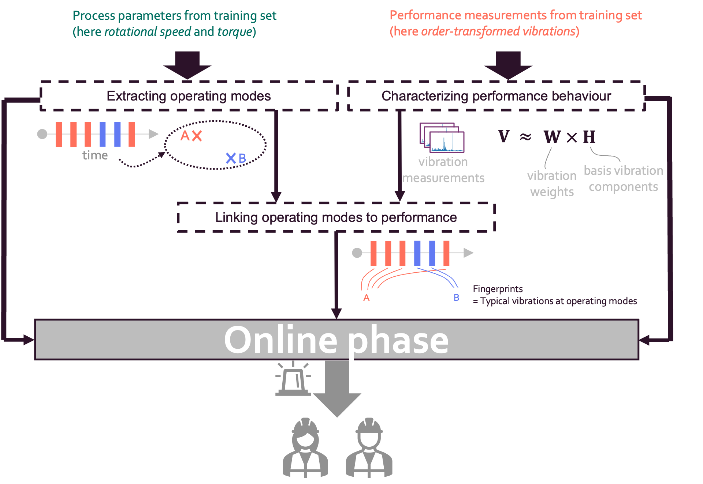

## Introduction
 

### Description

 

Industry 4.0 leverages on the advanced AI technologies to enable anomaly detection and performance profiling of industrial assets operating in different contexts. Context is defined by both internal and external factors, such as operational conditions, environmental variables, and usage patterns. For this reason, context-aware methods are fundamental to identify anomalies and to ensure accurate and reliable asset profiling. These methods allow for real-time monitoring and enable enhanced performance and reduce downtime of assets.

 

### Business goal

 

The business goal related to this Starter Kit (SK) is to illustrate a data-driven methodology to identify anomalies and profile the performance of assets operating in different contexts, i.e., in terms of process measurements reflecting the internal operations of the asset. As data-driven methodology, this SK focuses on the methodology developed by Fingerhut et al. [1, 2]. Conventional anomaly detection methods often detect anomalies when the operating conditions change, rendering them less applicable for real-world dynamic industrial use cases. In contrast, the methodology presented in this starterkit is suitable for these scenarios, because it considers the dynamic nature of operating conditions.

 

### Application context

 

Contextual anomaly detection and performance profiling play a relevant role in a variety of industrial contexts such as:

\- Raise warnings to anticipate and avoid safety-critical conditions,

\- Alert the need for inspection to avoid possible downtime and cost corrective maintenance,

\- Performance benchmarking

  

### Starter Kit outline

 

The SK is organised in five main sections. First, the required background knowledge is provided to understand the terminology used in the rest of the document. Second, a description of data generated by the assets along with its preprocessing is reported. Third, the methodology introduced by Fingerhut et al. [1] is illustrated highlighting how it can be used for performance profiling. Fourth, the validation of the methodology for anomaly detection is provided. Finally, conclusions are drawn.
At the end of the SK you will know how to:

\- Develop a model for anomaly detection and performance profiling

\- Experimentally validate the resulting model

 

### Dataset

 

The dataset we will use in this Starter Kit comes from the [PHM North America challenge '23](https://data.phmsociety.org/phm2023-conference-data-challenge/). This dataset collects the time series data from a gearbox subject to pitting, i.e. a fatigue failure of the gear tooth along with metadata. This dataset includes measurements under varied operating conditions, defined in terms of rotational speed and torque, from a healthy state as well as six known fault levels. The training data are collected from a range of different operating conditions under 15 different rotational speeds and 6 different torque levels.  For each operating condition, 5 vibration measurements were collected.
The vibration data is given in the time domain with a sampling rate of 20480Hz. The sampling duration differs between 3 and 12 seconds. For each vibration measurement there are tri-axial time-domain vibration measurements available (x, y and z). The vibrations are collected at different rotation per minute (rpm) and different runs.  Below, the user can get acquainted with the dataset by visualizing the vibration measurements in the three directions (x, y and z) for different rpm and runs.

 

### Methodology for contextual anomaly detection
 

The methodology can be divided into the offline and online phases. The offline phase focuses on performance profiling. More specifically, the operating modes of healthy assets are extracted and mapped to the expected performances. The online phase focuses on anomaly detection by exploiting the performance profiles extracted in the previous phase.

 

<u><b> Offline phase </b></u>

The general workflow of the offline phase is reported in the figure below.

 
<table><tr><td></td></tr></table>

 

This phase can be divided into three steps (See Figure above). The main goals of these phases can be summarized as follows:
1. **Characterizing performance  behaviour**. High-dimensional vibration signals are characterized in terms of a few vibration components that capture the fundamental vibration behaviour.
2. **Extracting operating modes**. Based on the process parameters, the operating modes are extracted and associated with each measurement. In the original methodology, a measurement is taken at a specific timestamp. However, in our use case, the gearbox dataset does not contain information about the point in time when a measurement was taken.
3. **Linking operating modes to performance behaviour**. For each operating mode a performance fingerprint is associated.

 

<u><b> Online phase </b></u>

The general workflow of the online phase is reported in the figure below. Note that due to the nature of the data used in this use case, some steps are no longer necessary or become very simplified. These steps are still included for the sake of completeness.

 

<table><tr><td></td></tr></table>

 

This phase can be divided into five steps (See Figure above). The main goals of these phases can be summarized as follows:

4. **Windowing incoming streaming**. Streaming data is usually divided into batches. This activity is generally performed to avoid processing each new received data point as it arrives. However, in the use case of this starter kit there is no streaming data, so windowing is not needed and this step is skipped.

5. **Detecting of the operating context**. Each timestamp is associated with an operating mode which was identified during the offline phase. In this use case, operating modes are linked to vibration measurements without timestamps.

6. **Deriving the performance profiles**. Each vibration measurement is characterized in terms of the vibration components that were extracted in the first step of the offline phase.

7. **Estimating the fingerprint offset**. For each vibration measurement, the _offset_ is calculated between the online profiles and the offline fingerprints. The offset quantifies to what extent the observed vibration behaviour differs from the expected vibration behaviour expressed through the fingerprints.

8. **Deriving alarms**. In the original paper [2], based on the offset, an anomaly score is computed for each timestamp. This score is monitored over time to trigger alarms. In this use case, the monitoring of the anomaly score is not possible since the timestamps in the test set are not ordered. For this reason, this step is skipped.

 

### References

[1] F. Fingerhut, S. Klein, M. Verbeke, S. Rajendran and E. Tsiporkova, "Multi-view contextual performance profiling in rotating machinery," 2023 IEEE International Conference on Prognostics and Health Management (ICPHM), Montreal, QC, Canada, 2023, pp. 343-350, [doi: 10.1109/ICPHM57936.2023.10194172](https://ieeexplore.ieee.org/document/10194172).

[2] F. Fingerhut, M. Verbeke and E. Tsiporkova, "Unsupervised context-sensitive anomaly detection on streaming data relying on multi-view profiling," 2024 IEEE International Conference on Evolving and Adaptive Intelligent Systems (EAIS), Madrid, Spain, 2024, pp. 1-10, [doi: 10.1109/EAIS58494.2024.10569106](https://ieeexplore.ieee.org/document/10569106).

[3] D. Lee, S. Seung, [“Learning the parts of objects by non-negative matrix factorization”](https://www.cs.columbia.edu/~blei/fogm/2020F/readings/LeeSeung1999.pdf), 1999
